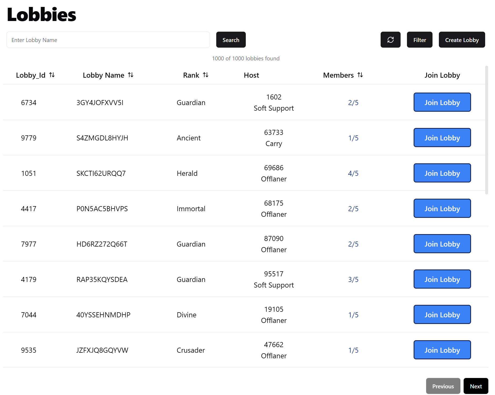
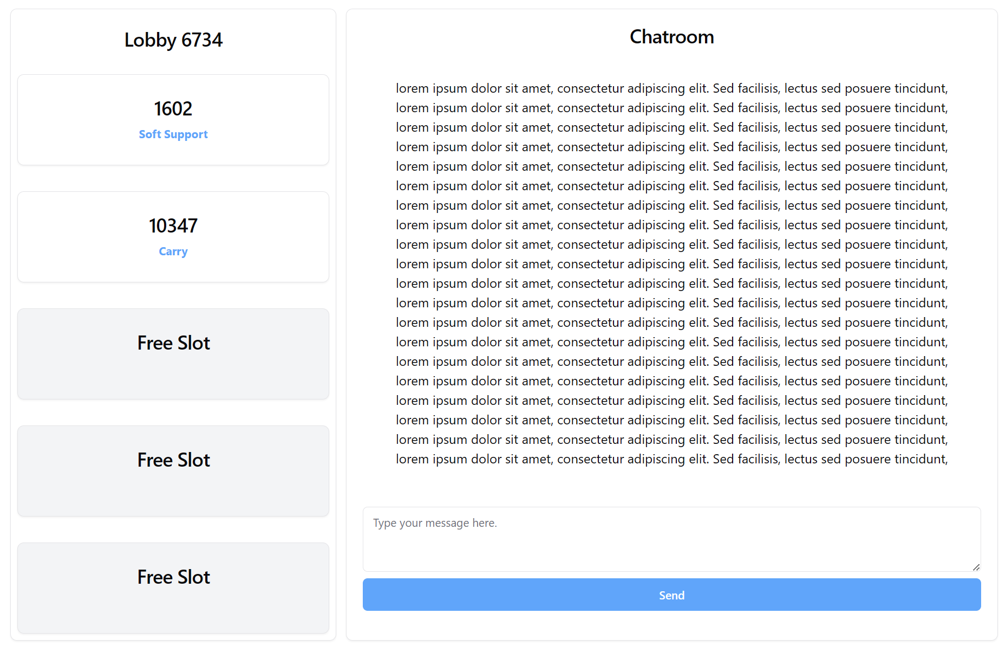

# LobbyConcept

Doesn't have back-end yet but going there. Chatroom/messaging component is expeccted to be a separate component 
since it will be used for group-messaging and private messaging (?). Will use Jotai for state management and 
Joi for data validation (custom pipe validation for NestJS). After back-end refactor the front-end, 
more features to be added, need to do the friendlist for inviting (a friend)/kicking members from the lobby.

